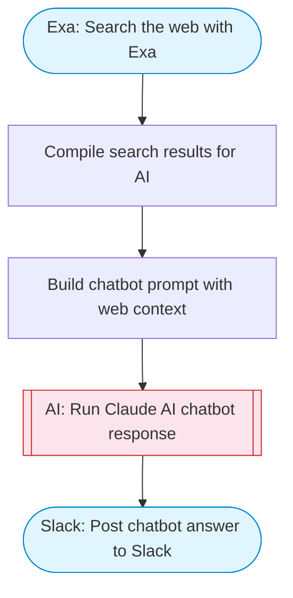

# Web search chatbot with Exa and Claude

Takes a user question, searches the web with Exa for current information, feeds the results to Claude AI for an informed answer, and posts the response to Slack with source links.

> **Works with any AI agent.** Paste this page's URL into Claude Code, Codex, Cursor, Windsurf, OpenClaw, or any coding agent — it will read the docs, connect your platforms, and run this flow for you.

## Quick Start

```bash
# 1. Connect your platforms (one-time setup)
one add exa
one add slack

# 2. Run the flow
one flow execute n8n-2026-web-search-chatbot \
  --input slackChannel="C01ABC123" \
  --input question="your question here"
```

## Platforms

| Platform | Used for |
|----------|----------|
| Exa | Web search |
| Slack | Post chatbot answer to Slack |

> Don't have these connected yet? Run `one list` to check, then `one add <platform>` to connect.

## What it does

1. Search the web with Exa
2. Compile search results for AI
3. Build chatbot prompt with web context
4. Run Claude AI chatbot response
5. Post chatbot answer to Slack

## Flow diagram



## Inputs

| Input | Required | Description |
|-------|----------|-------------|
| `slackChannel` | Yes | Slack channel to post the answer |
| `question` | Yes | The question or topic to search and answer |

---

<sub>Based on [n8n #2026](https://n8n.io/workflows/1959) · 90.5K views on n8n · by [davidn8n](https://n8n.io/creators/davidn8n) · Converted to One CLI on 2026-03-25</sub>
