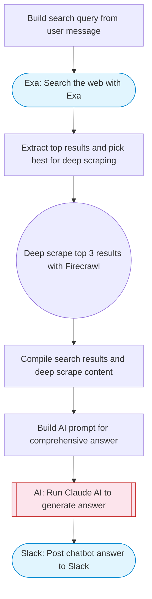

# Web search chatbot with Exa and Firecrawl deep scraping

Takes a user question, performs a web search with Exa, deep-scrapes the most relevant results with Firecrawl, uses Claude AI to synthesize a detailed answer with source citations, and posts it to Slack.

> **Works with any AI agent.** Paste this page's URL into Claude Code, Codex, Cursor, Windsurf, OpenClaw, or any coding agent — it will read the docs, connect your platforms, and run this flow for you.

## Quick Start

```bash
# 1. Connect your platforms (one-time setup)
one add exa
one add firecrawl
one add slack

# 2. Run the flow
one flow execute n8n-3189-web-search-chatbot \
  --input slackChannel="C01ABC123" \
  --input userMessage="..."
```

## Platforms

| Platform | Used for |
|----------|----------|
| Exa | Web search |
| Firecrawl | Deep scraping |
| Slack | Posting the answer |

> Don't have these connected yet? Run `one list` to check, then `one add <platform>` to connect.

## What it does

1. Build search query from user message
2. Search the web with Exa
3. Extract top results and pick best for deep scraping
4. Deep scrape top 3 results with Firecrawl
5. Compile search results and deep scrape content
6. Build AI prompt for comprehensive answer
7. Run Claude AI to generate answer
8. Post chatbot answer to Slack

## Flow diagram



## Inputs

| Input | Required | Description |
|-------|----------|-------------|
| `slackChannel` | Yes | Slack channel ID for the chatbot response |
| `userMessage` | Yes | User question or message to answer using web search (e.g. 'What are the best practices for Kubernetes security in 2025?') |

---

<sub>Based on [n8n #3189](https://n8n.io/workflows/3189) · 24.6K views on n8n · by [joe](https://n8n.io/creators/joe) · Converted to One CLI on 2026-03-25</sub>
