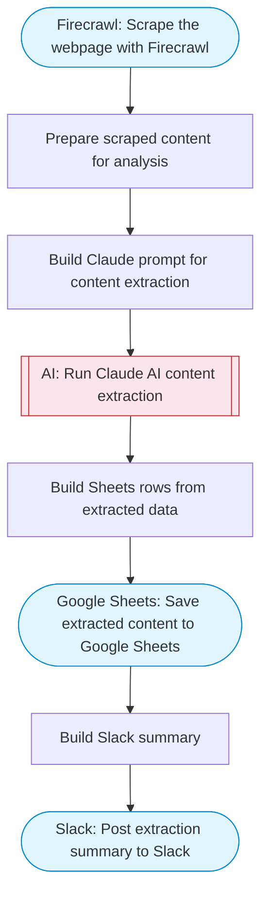

# Webpage Content Extractor & Analyzer

Scrapes a webpage via Firecrawl, uses Claude AI to extract structured content and key information, and saves the results to Google Sheets with a summary posted to Slack. Adapted from n8n's static HTML page serving workflow.

> **Works with any AI agent.** Paste this page's URL into Claude Code, Codex, Cursor, Windsurf, OpenClaw, or any coding agent — it will read the docs, connect your platforms, and run this flow for you.

## Quick Start

```bash
# 1. Connect your platforms (one-time setup)
one add firecrawl
one add google-sheets
one add slack

# 2. Run the flow
one flow execute n8n-1306-webpage-content-extractor \
  --input url="https://example.com" \
  --input spreadsheetId="..." \
  --input slackChannel="C01ABC123" \
  --input extractionFocus="..."
```

## Platforms

| Platform | Used for |
|----------|----------|
| Firecrawl | Web scraping |
| Google Sheets | Saving extracted content |
| Slack | Posting summary |

> Don't have these connected yet? Run `one list` to check, then `one add <platform>` to connect.

## What it does

1. Scrape the webpage with Firecrawl
2. Prepare scraped content for analysis
3. Build Claude prompt for content extraction
4. Run Claude AI content extraction
5. Save extracted content to Google Sheets
6. Post extraction summary to Slack

## Flow diagram



## Inputs

| Input | Required | Description |
|-------|----------|-------------|
| `url` | Yes | URL of the webpage to extract content from |
| `spreadsheetId` | Yes | Google Sheets spreadsheet ID for storing extracted data |
| `slackChannel` | Yes | Slack channel for the summary |
| `extractionFocus` | No | What to focus on extracting from the page (default: Extract all key information, headings, data points, and contact details) |

---

<sub>Based on [n8n #1306](https://n8n.io/workflows/1306) · 20.6K views on n8n · by [mutedjam](https://n8n.io/creators/mutedjam) · Converted to One CLI on 2026-03-25</sub>
