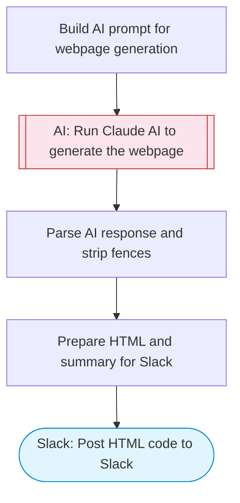

# Webpage Generator — Claude AI Creates HTML, Posts to Slack

Takes a description of a desired webpage, uses Claude AI to generate a complete, styled HTML page, and posts the code to Slack for review and use.

> **Works with any AI agent.** Paste this page's URL into Claude Code, Codex, Cursor, Windsurf, OpenClaw, or any coding agent — it will read the docs, connect your platforms, and run this flow for you.

## Quick Start

```bash
# 1. Connect your platforms (one-time setup)
one add slack

# 2. Run the flow
one flow execute n8n-2388-webpage-generator \
  --input slackChannel="C01ABC123" \
  --input pageDescription="..." \
  --input style="..."
```

## Platforms

| Platform | Used for |
|----------|----------|
| Slack | Post HTML code to Slack |

> Don't have these connected yet? Run `one list` to check, then `one add <platform>` to connect.

## What it does

1. Build AI prompt for webpage generation
2. Run Claude AI to generate the webpage
3. Parse AI response and strip fences
4. Prepare HTML and summary for Slack
5. Post HTML code to Slack

## Flow diagram



## Inputs

| Input | Required | Description |
|-------|----------|-------------|
| `slackChannel` | Yes | Slack channel ID to post the generated HTML |
| `pageDescription` | Yes | Description of the webpage to generate (e.g. 'A landing page for an AI productivity tool with hero section, features, and pricing') |
| `style` | No | Visual style preferences (e.g. 'dark theme, minimalist', 'colorful, playful') (default: modern, clean, responsive) |

---

<sub>Based on [n8n #2388](https://n8n.io/workflows/2388) · 43.4K views on n8n · by [agentstudio](https://n8n.io/creators/agentstudio) · Converted to One CLI on 2026-03-25</sub>
