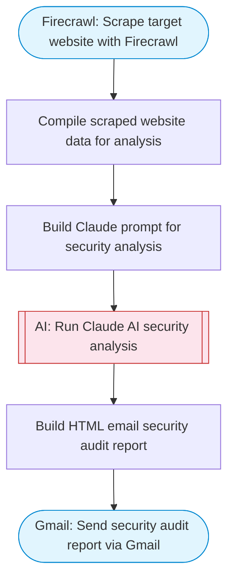

# AI-powered website security audit

Scrapes a target website using Firecrawl, Claude AI analyzes security headers, SSL configuration, potential vulnerabilities, and common security issues, then emails the detailed security audit report via Gmail. Adapted from n8n's WebSecScan security auditor workflow.

> **Works with any AI agent.** Paste this page's URL into Claude Code, Codex, Cursor, Windsurf, OpenClaw, or any coding agent — it will read the docs, connect your platforms, and run this flow for you.

## Quick Start

```bash
# 1. Connect your platforms (one-time setup)
one add firecrawl
one add gmail

# 2. Run the flow
one flow execute n8n-196-website-security-audit \
  --input targetUrl="https://example.com" \
  --input recipientEmail="user@example.com" \
  --input senderName="Alex"
```

## Platforms

| Platform | Used for |
|----------|----------|
| Firecrawl | Website scraping |
| Gmail | Sending the audit report |

> Don't have these connected yet? Run `one list` to check, then `one add <platform>` to connect.

## What it does

1. Scrape target website with Firecrawl
2. Compile scraped website data for analysis
3. Build Claude prompt for security analysis
4. Run Claude AI security analysis
5. Build HTML email security audit report
6. Send security audit report via Gmail

## Flow diagram



## Inputs

| Input | Required | Description |
|-------|----------|-------------|
| `targetUrl` | Yes | URL of the website to audit (e.g., https://example.com) |
| `recipientEmail` | Yes | Email address to send the security audit report to |
| `senderName` | No | Sender name for the audit email (default: Security Audit Bot) |

---

<sub>Based on [n8n #196](https://n8n.io/workflows/196) · 31.3K views on n8n · Converted to One CLI on 2026-03-25</sub>
