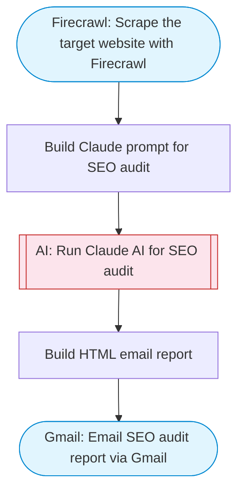

# Website SEO analyzer

Performs an on-page SEO audit by scraping any website URL with Firecrawl, using Claude to analyze SEO factors (title tags, meta descriptions, headings, content quality, technical issues), and emailing the detailed audit report via Gmail.

> **Works with any AI agent.** Paste this page's URL into Claude Code, Codex, Cursor, Windsurf, OpenClaw, or any coding agent — it will read the docs, connect your platforms, and run this flow for you.

## Quick Start

```bash
# 1. Connect your platforms (one-time setup)
one add firecrawl
one add gmail

# 2. Run the flow
one flow execute n8n-3224-website-seo-analyzer \
  --input url="https://example.com" \
  --input recipientEmail="user@example.com"
```

## Platforms

| Platform | Used for |
|----------|----------|
| Firecrawl | Scraping |
| Gmail | Sending the audit report |

> Don't have these connected yet? Run `one list` to check, then `one add <platform>` to connect.

## What it does

1. Scrape the target website with Firecrawl
2. Build Claude prompt for SEO audit
3. Run Claude AI for SEO audit
4. Build HTML email report
5. Email SEO audit report via Gmail

## Flow diagram



## Inputs

| Input | Required | Description |
|-------|----------|-------------|
| `url` | Yes | Website URL to analyze for SEO (e.g. 'https://example.com') |
| `recipientEmail` | Yes | Email address to receive the SEO audit report |

---

<sub>Based on [n8n #3224](https://n8n.io/workflows/3224) · 62.1K views on n8n · by [notanothermarketer](https://n8n.io/creators/notanothermarketer) · Converted to One CLI on 2026-03-25</sub>
