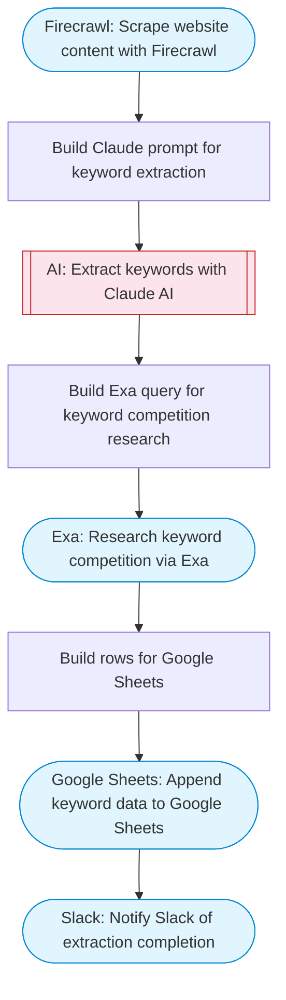

# Website Content Scraper and SEO Keyword Extractor

Scrapes a website URL with Firecrawl, extracts structured content and SEO keywords using Claude AI, researches keyword competition via Exa, and logs all results to a Google Sheet.

> **Works with any AI agent.** Paste this page's URL into Claude Code, Codex, Cursor, Windsurf, OpenClaw, or any coding agent — it will read the docs, connect your platforms, and run this flow for you.

## Quick Start

```bash
# 1. Connect your platforms (one-time setup)
one add firecrawl
one add exa
one add google-sheets
one add slack

# 2. Run the flow
one flow execute n8n-5657-website-seo-keyword-extractor \
  --input targetUrl="https://example.com" \
  --input spreadsheetId="..." \
  --input sheetName="..." \
  --input slackChannel="C01ABC123"
```

## Platforms

| Platform | Used for |
|----------|----------|
| Firecrawl | Web scraping |
| Exa | Keyword research |
| Google Sheets | Connection key |
| Slack | Notifications |

> Don't have these connected yet? Run `one list` to check, then `one add <platform>` to connect.

## What it does

1. Scrape website content with Firecrawl
2. Build Claude prompt for keyword extraction
3. Extract keywords with Claude AI
4. Build Exa query for keyword competition research
5. Research keyword competition via Exa
6. Build rows for Google Sheets
7. Append keyword data to Google Sheets
8. Notify Slack of extraction completion

## Flow diagram



## Inputs

| Input | Required | Description |
|-------|----------|-------------|
| `targetUrl` | Yes | Website URL to scrape and analyze for SEO keywords |
| `spreadsheetId` | Yes | Google Sheets spreadsheet ID to store keyword data |
| `sheetName` | No | Sheet tab name (default: SEO Keywords) |
| `slackChannel` | Yes | Slack channel for completion notification |

---

<sub>Based on [n8n #5657](https://n8n.io/workflows/5657) · 22.9K views on n8n · by [abhishekpatoliya](https://n8n.io/creators/abhishekpatoliya) · Converted to One CLI on 2026-03-25</sub>
