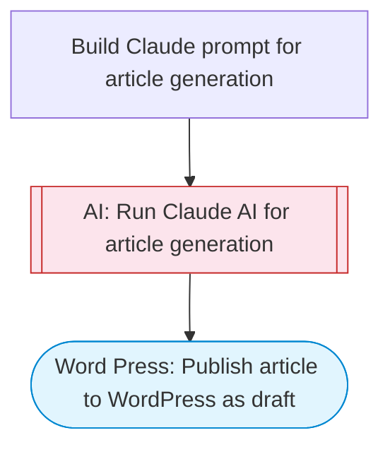

# WordPress AI content generator

Uses Claude to generate a complete blog article from a topic prompt, including title, HTML content, excerpt, tags, and meta description, then publishes it to WordPress as a draft post.

> **Works with any AI agent.** Paste this page's URL into Claude Code, Codex, Cursor, Windsurf, OpenClaw, or any coding agent — it will read the docs, connect your platforms, and run this flow for you.

## Quick Start

```bash
# 1. Connect your platforms (one-time setup)
one add word-press

# 2. Run the flow
one flow execute n8n-2813-wordpress-content-generator \
  --input site="..." \
  --input topic="your topic here" \
  --input tone="..." \
  --input wordCount="..." \
  --input language="..."
```

## Platforms

| Platform | Used for |
|----------|----------|
| Word Press | Wordpress connection key for publishing |

> Don't have these connected yet? Run `one list` to check, then `one add <platform>` to connect.

## What it does

1. Build Claude prompt for article generation
2. Run Claude AI for article generation
3. Publish article to WordPress as draft

## Flow diagram



## Inputs

| Input | Required | Description |
|-------|----------|-------------|
| `site` | Yes | WordPress site ID or domain (e.g. 'mysite.wordpress.com') |
| `topic` | Yes | Topic or prompt for the article (e.g. '10 Best Productivity Tips for Remote Workers') |
| `tone` | No | Writing tone: professional, casual, authoritative, conversational (default: professional) |
| `wordCount` | No | Target word count for the article (default: 1200) |
| `language` | No | Language for the article (e.g. 'English', 'Spanish') (default: English) |

---

<sub>Based on [n8n #2813](https://n8n.io/workflows/2813) · 46.9K views on n8n · by [n3witalia](https://n8n.io/creators/n3witalia) · Converted to One CLI on 2026-03-25</sub>
