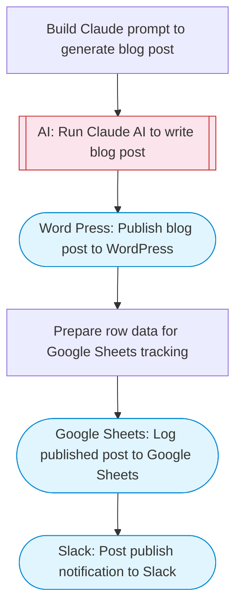

# WordPress Content Pipeline — Claude writes, publishes, tracks in Sheets

Uses Claude AI to generate blog content on a given topic, publishes the post to WordPress, and logs the publication details to Google Sheets for tracking.

> **Works with any AI agent.** Paste this page's URL into Claude Code, Codex, Cursor, Windsurf, OpenClaw, or any coding agent — it will read the docs, connect your platforms, and run this flow for you.

## Quick Start

```bash
# 1. Connect your platforms (one-time setup)
one add word-press
one add google-sheets
one add slack

# 2. Run the flow
one flow execute n8n-3018-wordpress-content-pipeline \
  --input slackChannel="C01ABC123" \
  --input wordpressSiteId="..." \
  --input spreadsheetUrl="https://example.com" \
  --input sheetName="..." \
  --input topic="your topic here" \
  --input tone="..." \
  --input wordCount="..."
```

## Platforms

| Platform | Used for |
|----------|----------|
| Word Press | Wordpress connection key |
| Google Sheets | Tracking |
| Slack | Notifications |

> Don't have these connected yet? Run `one list` to check, then `one add <platform>` to connect.

## What it does

1. Build Claude prompt to generate blog post
2. Run Claude AI to write blog post
3. Publish blog post to WordPress
4. Prepare row data for Google Sheets tracking
5. Log published post to Google Sheets
6. Post publish notification to Slack

## Flow diagram



## Inputs

| Input | Required | Description |
|-------|----------|-------------|
| `slackChannel` | Yes | Slack channel ID for publish notifications |
| `wordpressSiteId` | Yes | WordPress site ID or domain (e.g. mysite.wordpress.com) |
| `spreadsheetUrl` | Yes | Google Sheets URL to log published posts (columns: Date, Title, URL, Status, WordCount) |
| `sheetName` | No | Sheet tab name for tracking (default: Sheet1) |
| `topic` | Yes | Blog post topic or keyword to write about |
| `tone` | No | Writing tone (e.g. casual, formal, technical) (default: professional and engaging) |
| `wordCount` | No | Target word count for the blog post (default: 800) |

---

<sub>Based on [n8n #3018](https://n8n.io/workflows/3018) · 40.9K views on n8n · by [xicpoywriter](https://n8n.io/creators/xicpoywriter) · Converted to One CLI on 2026-03-25</sub>
