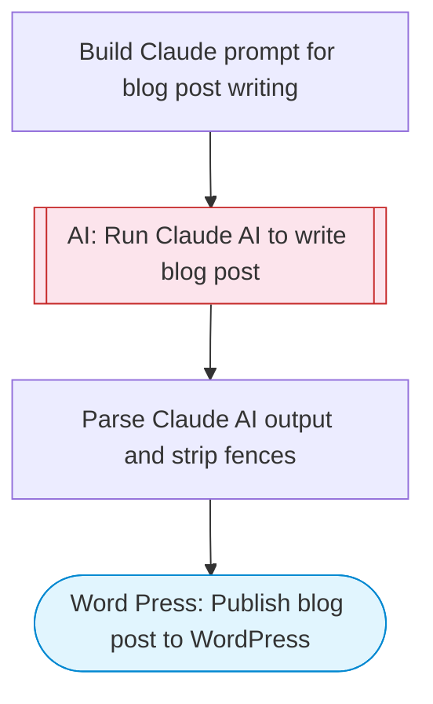

# AI WordPress Blog Post Writer

Takes a set of keywords, Claude AI researches and writes a complete SEO-optimized blog post with title, meta description, structured content, tags, and categories, then publishes directly to WordPress.

> **Works with any AI agent.** Paste this page's URL into Claude Code, Codex, Cursor, Windsurf, OpenClaw, or any coding agent — it will read the docs, connect your platforms, and run this flow for you.

## Quick Start

```bash
# 1. Connect your platforms (one-time setup)
one add word-press

# 2. Run the flow
one flow execute n8n-2187-wordpress-post-ai \
  --input wordpressSite="..." \
  --input keywords="..." \
  --input tone="..." \
  --input wordCount="..." \
  --input postStatus="..."
```

## Platforms

| Platform | Used for |
|----------|----------|
| Word Press | Wordpress connection key for publishing posts |

> Don't have these connected yet? Run `one list` to check, then `one add <platform>` to connect.

## What it does

1. Build Claude prompt for blog post writing
2. Run Claude AI to write blog post
3. Parse Claude AI output and strip fences
4. Publish blog post to WordPress

## Flow diagram



## Inputs

| Input | Required | Description |
|-------|----------|-------------|
| `wordpressSite` | Yes | WordPress site ID or domain (e.g. 'mysite.wordpress.com' or '82974409') |
| `keywords` | Yes | Comma-separated keywords to write about (e.g. 'AI automation, workflow, productivity') |
| `tone` | No | Writing tone (default: 'professional yet conversational') (default: professional yet conversational) |
| `wordCount` | No | Target word count (default: 1500) (default: 1500) |
| `postStatus` | No | Post status: 'draft', 'publish', or 'pending' (default: 'draft') (default: draft) |

---

<sub>Based on [n8n #2187](https://n8n.io/workflows/2187) · 85.5K views on n8n · by [gandreini](https://n8n.io/creators/gandreini) · Converted to One CLI on 2026-03-25</sub>
