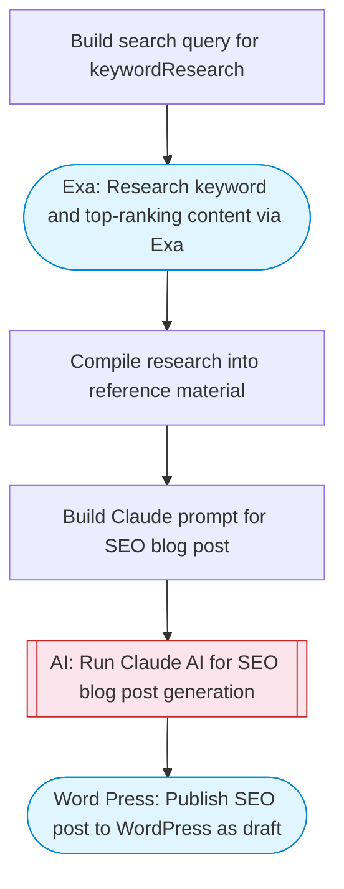

# WordPress SEO-optimized post generator

Researches a keyword using Exa, uses Claude to write an SEO-optimized blog post with title, meta description, and structured content, then publishes it to WordPress as a draft post.

> **Works with any AI agent.** Paste this page's URL into Claude Code, Codex, Cursor, Windsurf, OpenClaw, or any coding agent — it will read the docs, connect your platforms, and run this flow for you.

## Quick Start

```bash
# 1. Connect your platforms (one-time setup)
one add exa
one add word-press

# 2. Run the flow
one flow execute n8n-3085-wordpress-seo-posts \
  --input site="..." \
  --input keyword="..." \
  --input tone="..." \
  --input wordCount="..."
```

## Platforms

| Platform | Used for |
|----------|----------|
| Exa | Keyword research |
| Word Press | Wordpress connection key for publishing |

> Don't have these connected yet? Run `one list` to check, then `one add <platform>` to connect.

## What it does

1. Build search query for keywordResearch
2. Research keyword and top-ranking content via Exa
3. Compile research into reference material
4. Build Claude prompt for SEO blog post
5. Run Claude AI for SEO blog post generation
6. Publish SEO post to WordPress as draft

## Flow diagram



## Inputs

| Input | Required | Description |
|-------|----------|-------------|
| `site` | Yes | WordPress site ID or domain (e.g. 'mysite.wordpress.com') |
| `keyword` | Yes | Target SEO keyword or topic for the blog post |
| `tone` | No | Writing tone: professional, casual, authoritative, friendly (default: professional) |
| `wordCount` | No | Target word count for the article (default: 1500) |

---

<sub>Based on [n8n #3085](https://n8n.io/workflows/3085) · 56.8K views on n8n · by [n3witalia](https://n8n.io/creators/n3witalia) · Converted to One CLI on 2026-03-25</sub>
