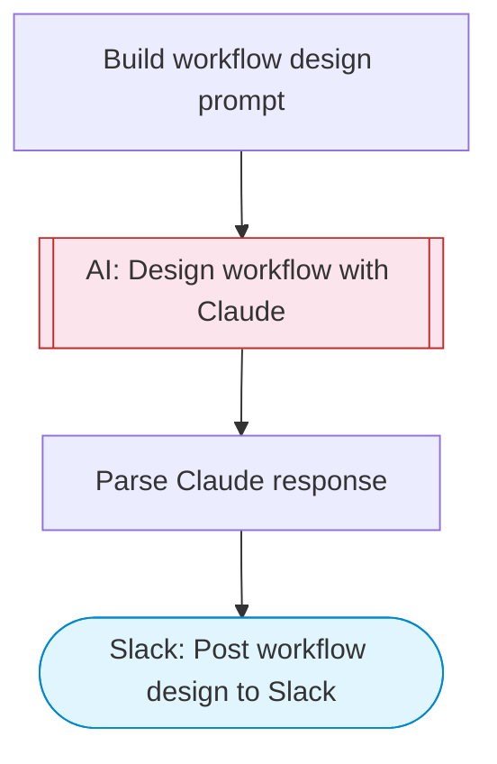

# Workflow Advisor

Describe any business task and Claude AI will design a complete automation workflow for it, recommending tools, steps, and integrations. The workflow blueprint is posted to Slack.

> **Works with any AI agent.** Paste this page's URL into Claude Code, Codex, Cursor, Windsurf, OpenClaw, or any coding agent — it will read the docs, connect your platforms, and run this flow for you.

## Quick Start

```bash
# 1. Connect your platforms (one-time setup)
one add slack

# 2. Run the flow
one flow execute n8n-5024-workflow-advisor \
  --input slackChannel="C01ABC123" \
  --input taskDescription="..." \
  --input constraints="..."
```

## Platforms

| Platform | Used for |
|----------|----------|
| Slack | Post workflow design to Slack |

> Don't have these connected yet? Run `one list` to check, then `one add <platform>` to connect.

## What it does

1. Build workflow design prompt
2. Design workflow with Claude
3. Parse Claude response
4. Post workflow design to Slack

## Flow diagram



## Inputs

| Input | Required | Description |
|-------|----------|-------------|
| `slackChannel` | Yes | Slack channel ID to post the workflow design |
| `taskDescription` | Yes | Describe the task you want to automate (e.g. 'When a new lead fills out a form, enrich their data, score them, and notify sales on Slack') |
| `constraints` | No | Any constraints or preferences (e.g. 'must use Google Sheets', 'budget-friendly tools only') (default: ) |

---

<sub>Based on [n8n #5024](https://n8n.io/workflows/5024) · 33.0K views on n8n · by [agents-by-franz](https://n8n.io/creators/agents-by-franz) · Converted to One CLI on 2026-03-25</sub>
