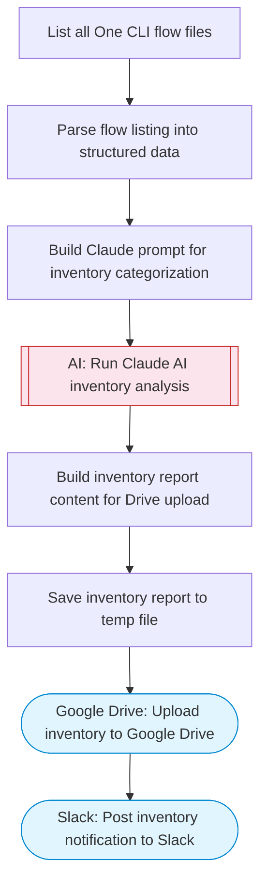

# Workflow Inventory to Google Drive

Lists all One CLI flow files from the local flows directory, uses Claude AI to summarize and categorize each workflow, and saves a structured inventory report as a file to Google Drive. Adapted from n8n's backup-all-workflows-to-Google-Drive workflow.

> **Works with any AI agent.** Paste this page's URL into Claude Code, Codex, Cursor, Windsurf, OpenClaw, or any coding agent — it will read the docs, connect your platforms, and run this flow for you.

## Quick Start

```bash
# 1. Connect your platforms (one-time setup)
one add google-drive
one add slack

# 2. Run the flow
one flow execute n8n-2886-workflow-inventory \
  --input slackChannel="C01ABC123" \
  --input flowsDirectory="..." \
  --input driveFolderId="..."
```

## Platforms

| Platform | Used for |
|----------|----------|
| Google Drive | Uploading the inventory |
| Slack | Posting notification |

> Don't have these connected yet? Run `one list` to check, then `one add <platform>` to connect.

## What it does

1. List all One CLI flow files
2. Parse flow listing into structured data
3. Build Claude prompt for inventory categorization
4. Run Claude AI inventory analysis
5. Build inventory report content for Drive upload
6. Save inventory report to temp file
7. Upload inventory to Google Drive
8. Post inventory notification to Slack

## Flow diagram



## Inputs

| Input | Required | Description |
|-------|----------|-------------|
| `slackChannel` | Yes | Slack channel ID to post the inventory notification |
| `flowsDirectory` | No | Path to the One CLI flows directory (defaults to .one/flows/) (default: ) |
| `driveFolderId` | No | Google Drive folder ID to save the inventory (optional — saves to root if omitted) (default: ) |

---

<sub>Based on [n8n #2886](https://n8n.io/workflows/2886) · 44.9K views on n8n · by [imperolq](https://n8n.io/creators/imperolq) · Converted to One CLI on 2026-03-25</sub>
