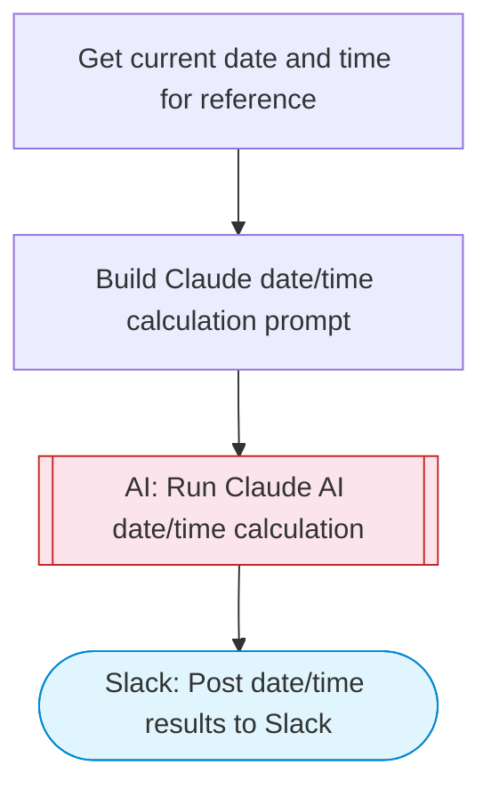

# Date and time calculator with Claude formatting

Takes a date/time query (calculations, formatting, timezone conversions), uses Claude AI to compute and format the results with clear explanations, and posts the output to Slack.

> **Works with any AI agent.** Paste this page's URL into Claude Code, Codex, Cursor, Windsurf, OpenClaw, or any coding agent — it will read the docs, connect your platforms, and run this flow for you.

## Quick Start

```bash
# 1. Connect your platforms (one-time setup)
one add slack

# 2. Run the flow
one flow execute n8n-5170-working-dates \
  --input slackChannel="C01ABC123" \
  --input dateQuery="your question here" \
  --input timezone="..."
```

## Platforms

| Platform | Used for |
|----------|----------|
| Slack | Post date/time results to Slack |

> Don't have these connected yet? Run `one list` to check, then `one add <platform>` to connect.

## What it does

1. Get current date and time for reference
2. Build Claude date/time calculation prompt
3. Run Claude AI date/time calculation
4. Post date/time results to Slack

## Flow diagram



## Inputs

| Input | Required | Description |
|-------|----------|-------------|
| `slackChannel` | Yes | Slack channel to post the date/time results |
| `dateQuery` | Yes | Date/time query (e.g. 'What date is 45 business days from today?', 'Convert 3pm EST to all US timezones', 'How many days between Jan 15 and March 30?') |
| `timezone` | No | Default timezone for calculations (e.g. 'America/New_York', 'Europe/London', 'UTC') (default: UTC) |

---

<sub>Based on [n8n #5170](https://n8n.io/workflows/1744) · 85.1K views on n8n · by [lucaspeyrin](https://n8n.io/creators/lucaspeyrin) · Converted to One CLI on 2026-03-25</sub>
