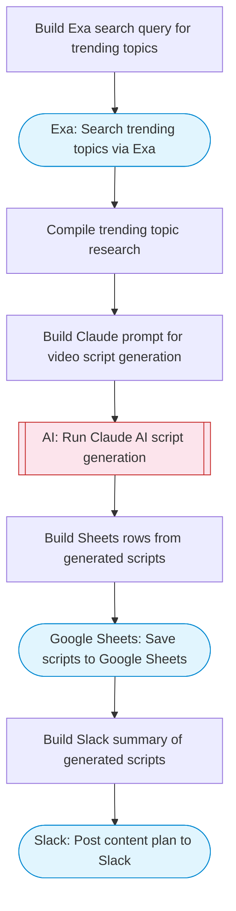

# Short-Form Video Content Generator

Researches trending topics via Exa, uses Claude AI to generate engaging short-form video scripts with hooks and CTAs, and saves the content plan to Google Sheets with a summary posted to Slack. Adapted from n8n's YouTube Shorts automation tool.

> **Works with any AI agent.** Paste this page's URL into Claude Code, Codex, Cursor, Windsurf, OpenClaw, or any coding agent — it will read the docs, connect your platforms, and run this flow for you.

## Quick Start

```bash
# 1. Connect your platforms (one-time setup)
one add exa
one add google-sheets
one add slack

# 2. Run the flow
one flow execute n8n-2941-youtube-shorts-content \
  --input spreadsheetId="..." \
  --input slackChannel="C01ABC123" \
  --input niche="..." \
  --input numberOfScripts="..." \
  --input targetPlatform="..."
```

## Platforms

| Platform | Used for |
|----------|----------|
| Exa | Trending topic research |
| Google Sheets | Saving content plan |
| Slack | Posting summary |

> Don't have these connected yet? Run `one list` to check, then `one add <platform>` to connect.

## What it does

1. Build Exa search query for trending topics
2. Search trending topics via Exa
3. Compile trending topic research
4. Build Claude prompt for video script generation
5. Run Claude AI script generation
6. Save scripts to Google Sheets
7. Post content plan to Slack

## Flow diagram



## Inputs

| Input | Required | Description |
|-------|----------|-------------|
| `spreadsheetId` | Yes | Google Sheets spreadsheet ID for the content plan |
| `slackChannel` | Yes | Slack channel ID for the summary |
| `niche` | Yes | Content niche or topic area (e.g. 'tech tutorials', 'fitness tips', 'cooking hacks') |
| `numberOfScripts` | No | Number of short-form video scripts to generate (default: 5) (default: 5) |
| `targetPlatform` | No | Target platform: YouTube Shorts, TikTok, Instagram Reels (default: YouTube Shorts) |

---

<sub>Based on [n8n #2941](https://n8n.io/workflows/2941) · 20.6K views on n8n · by [jonasbusch](https://n8n.io/creators/jonasbusch) · Converted to One CLI on 2026-03-25</sub>
