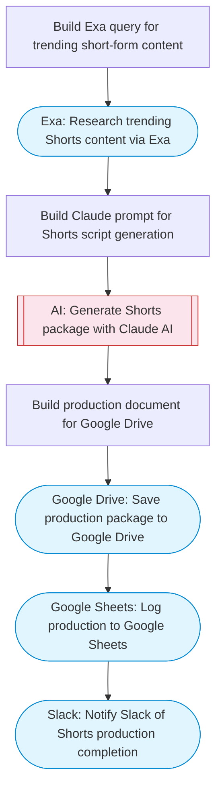

# One-Click YouTube Shorts Script and Storyboard Generator

Takes a topic, researches trending short-form content via Exa, generates a complete YouTube Shorts script with Claude AI including voiceover text, visual storyboard, and music cues, saves to Google Drive, and logs to Sheets.

> **Works with any AI agent.** Paste this page's URL into Claude Code, Codex, Cursor, Windsurf, OpenClaw, or any coding agent — it will read the docs, connect your platforms, and run this flow for you.

## Quick Start

```bash
# 1. Connect your platforms (one-time setup)
one add exa
one add google-drive
one add google-sheets
one add slack

# 2. Run the flow
one flow execute n8n-5683-youtube-shorts-generator \
  --input topic="your topic here" \
  --input spreadsheetId="..." \
  --input sheetName="..." \
  --input slackChannel="C01ABC123"
```

## Platforms

| Platform | Used for |
|----------|----------|
| Exa | Trend research |
| Google Drive | Connection key |
| Google Sheets | Production log |
| Slack | Notify Slack of Shorts production completion |

> Don't have these connected yet? Run `one list` to check, then `one add <platform>` to connect.

## What it does

1. Build Exa query for trending short-form content
2. Research trending Shorts content via Exa
3. Build Claude prompt for Shorts script generation
4. Generate Shorts package with Claude AI
5. Build production document for Google Drive
6. Save production package to Google Drive
7. Log production to Google Sheets
8. Notify Slack of Shorts production completion

## Flow diagram



## Inputs

| Input | Required | Description |
|-------|----------|-------------|
| `topic` | Yes | Topic or prompt for the YouTube Short (e.g. '5 AI tools you need to know') |
| `spreadsheetId` | Yes | Google Sheets spreadsheet ID for production log |
| `sheetName` | No | Sheet tab name (default: Shorts Log) |
| `slackChannel` | Yes | Slack channel for notification |

---

<sub>Based on [n8n #5683](https://n8n.io/workflows/5683) · 21.7K views on n8n · by [huzaifa404](https://n8n.io/creators/huzaifa404) · Converted to One CLI on 2026-03-25</sub>
