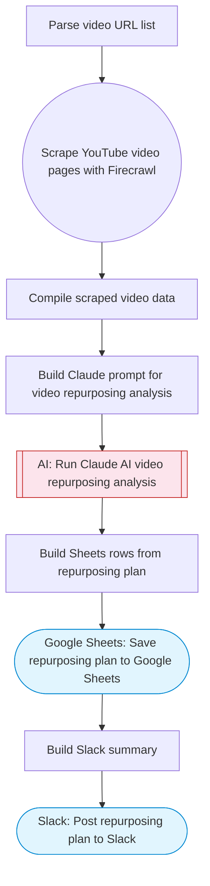

# Video Content Repurposing Planner

Analyzes YouTube video pages via Firecrawl scraping, uses Claude AI to identify the best clip-worthy moments for short-form repurposing, and saves a detailed repurposing plan to Google Sheets with a summary to Slack. Adapted from n8n's YouTube-to-Shorts with Klap workflow.

> **Works with any AI agent.** Paste this page's URL into Claude Code, Codex, Cursor, Windsurf, OpenClaw, or any coding agent — it will read the docs, connect your platforms, and run this flow for you.

## Quick Start

```bash
# 1. Connect your platforms (one-time setup)
one add firecrawl
one add google-sheets
one add slack

# 2. Run the flow
one flow execute n8n-5608-youtube-to-shorts-repurpose \
  --input videoUrls="https://example.com" \
  --input spreadsheetId="..." \
  --input slackChannel="C01ABC123" \
  --input targetPlatforms="..."
```

## Platforms

| Platform | Used for |
|----------|----------|
| Firecrawl | Scraping youtube pages |
| Google Sheets | Saving repurposing plan |
| Slack | Summary |

> Don't have these connected yet? Run `one list` to check, then `one add <platform>` to connect.

## What it does

1. Parse video URL list
2. Scrape YouTube video pages with Firecrawl
3. Compile scraped video data
4. Build Claude prompt for video repurposing analysis
5. Run Claude AI video repurposing analysis
6. Save repurposing plan to Google Sheets
7. Post repurposing plan to Slack

## Flow diagram



## Inputs

| Input | Required | Description |
|-------|----------|-------------|
| `videoUrls` | Yes | Comma-separated YouTube video URLs to analyze for repurposing |
| `spreadsheetId` | Yes | Google Sheets spreadsheet ID for the repurposing plan |
| `slackChannel` | Yes | Slack channel for summary |
| `targetPlatforms` | No | Target platforms for repurposed content (default: YouTube Shorts, TikTok, Instagram Reels) |

---

<sub>Based on [n8n #5608](https://n8n.io/workflows/5608) · 20.5K views on n8n · by [drfiras](https://n8n.io/creators/drfiras) · Converted to One CLI on 2026-03-25</sub>
