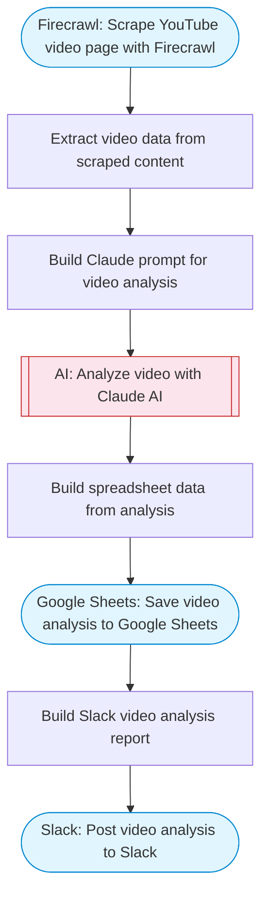

# Turn YouTube videos into summaries, transcripts, and visual insights

Takes a YouTube video URL, scrapes the video page with Firecrawl, uses Claude AI to generate summaries, extract key points, identify notable scenes, and saves structured results to Google Sheets with a Slack notification.

> **Works with any AI agent.** Paste this page's URL into Claude Code, Codex, Cursor, Windsurf, OpenClaw, or any coding agent — it will read the docs, connect your platforms, and run this flow for you.

## Quick Start

```bash
# 1. Connect your platforms (one-time setup)
one add firecrawl
one add google-sheets
one add slack

# 2. Run the flow
one flow execute n8n-3188-youtube-video-summarizer \
  --input youtubeUrl="https://example.com" \
  --input analysisType="..." \
  --input slackChannel="C01ABC123"
```

## Platforms

| Platform | Used for |
|----------|----------|
| Firecrawl | Scraping youtube page |
| Google Sheets | Saving results |
| Slack | Notifications |

> Don't have these connected yet? Run `one list` to check, then `one add <platform>` to connect.

## What it does

1. Scrape YouTube video page with Firecrawl
2. Extract video data from scraped content
3. Build Claude prompt for video analysis
4. Analyze video with Claude AI
5. Build spreadsheet data from analysis
6. Save video analysis to Google Sheets
7. Build Slack video analysis report
8. Post video analysis to Slack

## Flow diagram



## Inputs

| Input | Required | Description |
|-------|----------|-------------|
| `youtubeUrl` | Yes | YouTube video URL to analyze (e.g. 'https://www.youtube.com/watch?v=...') |
| `analysisType` | No | Type of analysis: summary, transcript, scenes, or all (default: summary) |
| `slackChannel` | Yes | Slack channel for video analysis results |

---

<sub>Based on [n8n #3188](https://n8n.io/workflows/3188) · 27.9K views on n8n · by [colleen](https://n8n.io/creators/colleen) · Converted to One CLI on 2026-03-25</sub>
